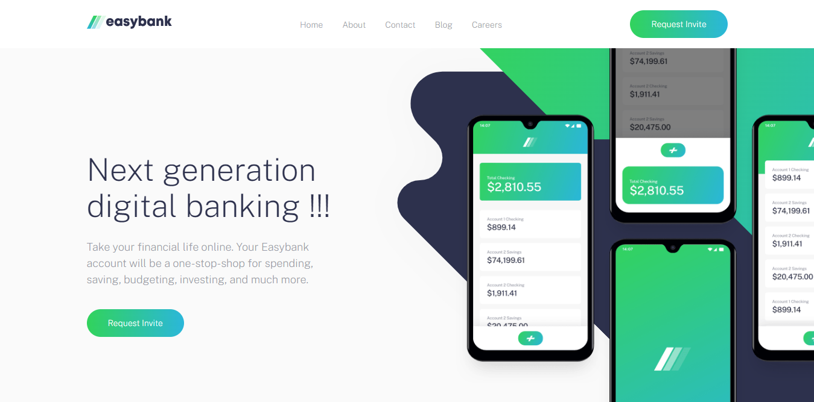

# Frontend Mentor - Easybank landing page solution

This is a solution to the [Easybank landing page challenge on Frontend Mentor](https://www.frontendmentor.io/challenges/easybank-landing-page-WaUhkoDN). Frontend Mentor challenges help you improve your coding skills by building realistic projects. 

## Table of contents

- [Overview](#overview)
  - [The challenge](#the-challenge)
  - [Screenshot](#screenshot)
  - [Links](#links)
- [My process](#my-process)
  - [Built with](#built-with)
- [Author](#author)
- [Acknowledgments](#acknowledgments)

## Overview

### The challenge

Users should be able to:
- View the optimal layout for the site depending on their device's screen size
- See hover states for all interactive elements on the page

### Screenshot

### Links

- Solution URL: [https://www.frontendmentor.io/solutions/easybank-responsive-landing-page-using-saas-js-aK_S0Wj66H](https://www.frontendmentor.io/solutions/easybank-responsive-landing-page-using-saas-js-aK_S0Wj66H)
- Live Site URL: [https://lincolnez.github.io/Easy_bank_landing_page/#](https://lincolnez.github.io/Easy_bank_landing_page/#)

## My process

### Built with

- Semantic HTML5 markup
- CSS custom properties
- Flexbox
- CSS Grid
- Mobile-first workflow
- JavaScript
- SaaS

## Author

- Frontend Mentor - [@lincolnez](https://www.frontendmentor.io/profile/lincolnez)

## Acknowledgments

inspiration from jessica chan - https://www.freecodecamp.org/news/author/thecodercoder/